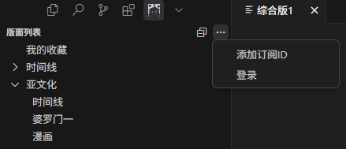
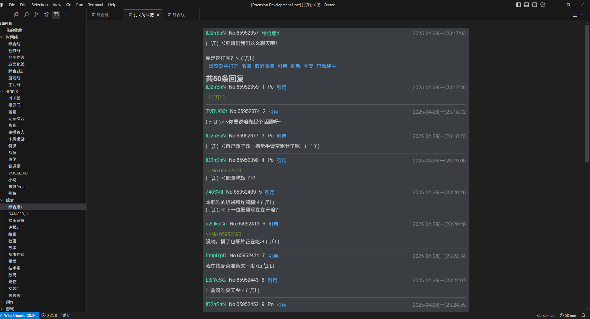
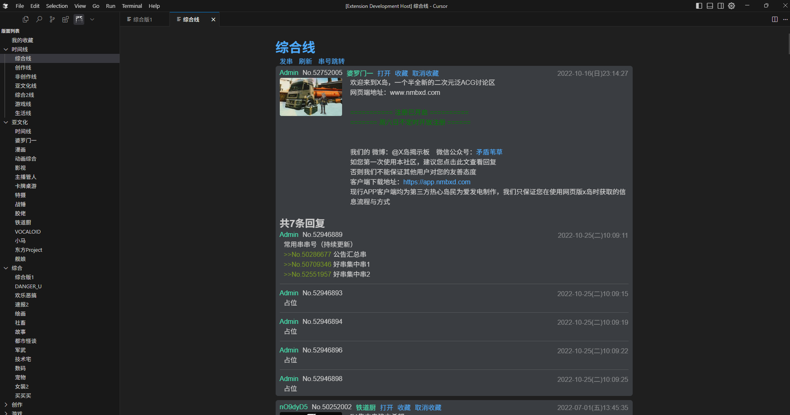

# x岛的vscode插件客户端
vscode插件商店里还没有x岛的客户端，写来上班摸鱼用的。

vscode插件商店地址: https://marketplace.visualstudio.com/items?itemName=shiyu.nmbxd

github repo: https://github.com/shiyu15/nmbxd_vscode
# 使用
第一次使用需要在插件的左上角，输入自己从x岛用户管理系统的二维码得到的cookie，类似这样`%B8H%1E5B%F6%F1%3B%08%98%C7Z%930X%H0%25a%0E`
然后才能访问速报2等登陆后才能访问的版面

下面是样例

# 反馈
欢迎提pr和issue，或者直接发邮件到 `m2457316417@outlook.com`

# 感谢
[xdcmd](https://github.com/TransparentLC/xdcmd): 一款命令行的python写的x岛客户端

[x岛的api](https://github.com/TransparentLC/xdcmd/wiki/%E8%87%AA%E5%B7%B1%E6%95%B4%E7%90%86%E7%9A%84-X-%E5%B2%9B%E5%8C%BF%E5%90%8D%E7%89%88-API-%E6%96%87%E6%A1%A3): xdcmd作者总结的x岛api，写的非常详细，帮了大忙

[apifox上的x岛api](https://apifox.com/apidoc/shared/aedf55de-a60a-4d71-aa9a-d37458239a70/api-59384753): 提供了多种语言的能跑通的x岛api，在前一个api文档出问题时可以结合这里调试

[nga-Mofish](https://github.com/DarrenIce/NGA-MoFish): nga的vscode插件

[opens1](https://github.com/NessajCN/opens1): s1的vscode插件

[vscode插件开发全攻略](https://www.cnblogs.com/liuxianan/p/vscode-plugin-overview.html)

[vscode插件开发中文文档](https://rackar.github.io/vscode-ext-doccn/)

[eta](https://www.etajs.cn/): eta模板引擎，处理html

# Todo list

- [x] 1. 显示图片
- [x] 2. 版块列表添加时间线
- [ ] 3. 添加代理
- [x] 4. 登录
- [ ] 5. 显示收藏列表
- [x] 6. 回帖
- [x] 7. 回帖添加引用
- [x] 8. 只看楼主
- [ ] 9. 完善搜索信息
- [x] 10. 输入串号，直达帖子
- [ ] 11. 完善错误输出，能分辨出是网络错误还是未能登录。
- [x] 12. 引用悬浮显示原帖
- [x] 13. 翻页

